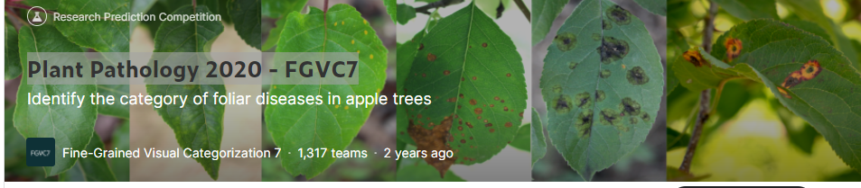
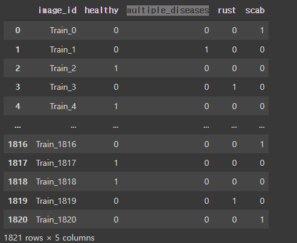

# Plant_Pathology-3Team
# 사용 기술 DL_Stack


<br>
     
</br>

# Kaggle - [Plant Pathology 2020 - FGVC7](https://www.kaggle.com/competitions/plant-pathology-2020-fgvc7/overview)



# 프로젝트 멤버
<a href="https://github.com/songjooya">
    
</a>
<a href="https://github.com/yjs6156">
    
</a>
<a href="https://github.com/yoonsic38">
    
</a>
<a href="https://github.com/ji-hun-choi">
    
</a>

```
전송주        윤진수        유윤식        최지훈
```

# 설명
- 나뭇잎의 이미지를 CNN 모델에 돌려 딥러닝으로 학습하는 것

# 데이터 설명
```
kaggle competitions download -c plant-pathology-2020-fgvc7
```
- https://www.kaggle.com/competitions/plant-pathology-2020-fgvc7/data
- TRAIN.csv
    - image_id, healthy, multiple_diseases, rust, scab
    - 컬럼 5개 중 TARGET 4개
    - 
    
- TEST.csv
    - image_id
    - 컬럼 1개
- image.file
    - Train 3642
    - Test 1821

# 사용 모델
- VGG16
- 간단 CNN
- Restnet32
- 최종 Resnet101 사용

# 최종 발표 자료
- [발표자료](./3조발표.ipynb)
